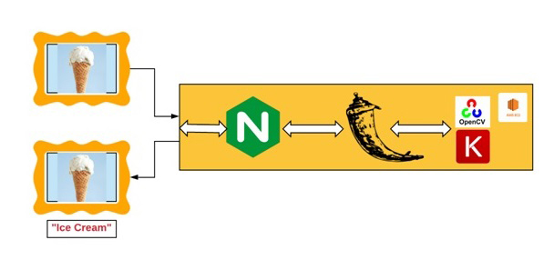
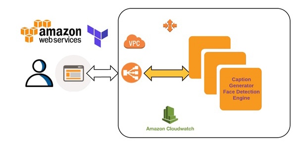

# Face Detection

Overview :

In the digital age where is there is a heavy emphasis on connectivity and interoperability, often the visually impaired don't have tools to participate. As a DevOps engineer, I'll be deploying a machine model that provides both voice/text labels to images so the visually impaired 'know what are in these images."

Architecture:
This project consists of two parts:
1. The app that take image to generate the voice of what is in the image resides in FaceDectionApp directory.

2. The aws infrasctrure that app will operate on resides at Infrastructure directory.

